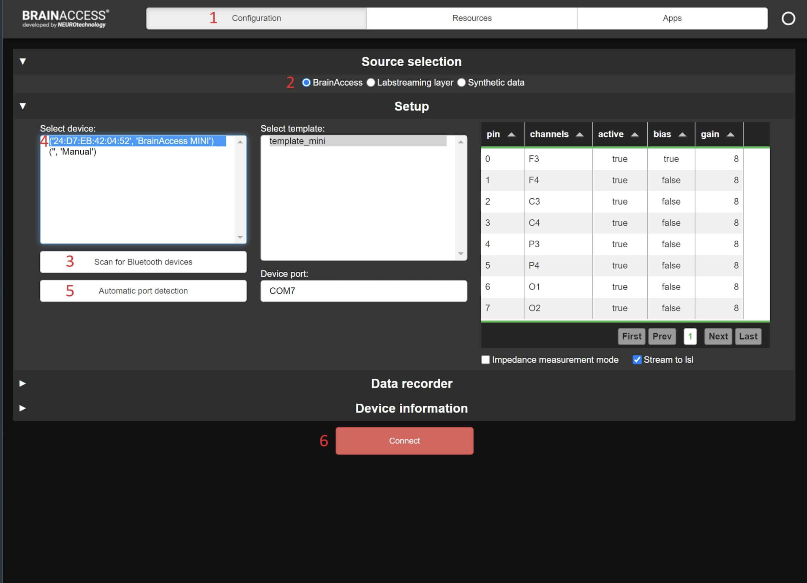

# Brain-Computer Interface: Tools Comparison and Overview

**Author**: Luka Žontar

**Description**: This document serves as documentation of a tool comparison and overview of different
brain-computer interfaces in the market. In essence, we split invasive and non-invasive BCI. Because
we work with non-invasive BCI in this project, we will also focus on non-invasive BCI tools and devices
in this document.

## Abbreviations

| Abbreviations | Description                            |
|---------------|----------------------------------------|
| DRL           | Drive right leg, bias electrode        |
| CMS           | Common mode sense, reference electrode |
| EEG           | Electroencephalogram                   |
| BCI           | Brain-computer interface               |

## Invasive BCI

To give a quick overview of invasive BCI, we prepared a list of invasive BCI that currently dominate the
market.

- [Blackrock Neurotech](https://blackrockneurotech.com/)
- [Synchron](https://synchron.com/)
- [BrainGate](https://www.braingate.org/)
- [Kernel](https://www.kernel.com/)
- [NextMind](https://github.com/Snapchat/NextMind)
- [ClearPoint Neuro](https://www.clearpointneuro.com/)
- [Neuralink](https://neuralink.com/)

****

## Non-invasive BCI

### Programmable non-invasive BCI

| **Feature\BCI**               | [EPOC Flex](https://www.emotiv.com/epoc-flex/) | [Unicorn Black Hybrid](https://www.unicorn-bi.com/product/unicorn-hybrid-black/) | [MindRove arc](https://mindrove.com/product/arc/) | [BrainAccess Extended Kit](https://www.brainaccess.ai/products/brainaccess-extended-kit/) |
|-------------------------------|------------------------------------------------|----------------------------------------------------------------------------------|---------------------------------------------------|-------------------------------------------------------------------------------------------|
| **Company**                   | [Emotiv](https://www.emotiv.com/)              | [Unicorn: the Brain Interface](https://www.unicorn-bi.com/)                      | [MindRove](https://mindrove.com/)                 | [BrainAccess](https://www.brainaccess.ai/)                                                |
| **Num. of EEG electrodes**    | 32                                             | 8                                                                                | 6                                                 | 16                                                                                        |
| **EEG sampling (Hz)**         | 1024                                           | 250                                                                              | 500                                               | 250                                                                                       |
| **EEG resolution (bit)**      | 14 + 2 (noise)                                 | 24                                                                               | 24                                                | 24                                                                                        |
| **Movement sampling (Hz)**    | 16                                             | 250                                                                              | 50                                                | 5010                                                                                      |
| **Movement resolution (bit)** | 8                                              | /                                                                                | /                                                 | 10                                                                                        |
| **Battery life (h)**          | 6-9                                            | 2                                                                                | 3-4                                               | 9                                                                                         |
| Price ($)                     | 1699 (not incl. software)                      | 990 (not incl. software)                                                         | 729 (incl. software)                              | 1400 (incl. software)                                                                     |

#### Software

##### [Emotiv](https://www.emotiv.com/)

###### EmotivPRO

- Data streams including EEG, motion data, frequency bands…
- Building **experiments**, publishing them locally, remotely or publicly.
- Acquiring data **safe** and **securely**.
- Post-processing **data analysis**.

###### EmotivBCI

- Mental Commands: Enables training of mental commands. Training is based on pattern recognition of neutral and command
  states.
  
- Allows for multiple **user profiles** for training.
- **Additional BCI visualizations.** Supports real-time visualization of:
    - **performance metrics** (focus, engagement, interest, excitement, stress, relaxation).
    - **facial expressions:** detects activity from facial and eye muscles (neutral, non-neutral expressions).
    - **motion sensors** (quaternion, accelerometer, magnetometer data).
      

###### BrainViz

- Shows **3D** brain activity **visualization**.
- Can show multiple brain areas.
  

##### [Unicorn: the Brain Interface](https://www.unicorn-bi.com/)

###### Unicorn Speller

- Unicorn Speller
    - Enables **spelling** by concentrating on specific characters.
    - Allows brain **painting**.

###### Unicorn Blondy Check

- **Neuromarketing software**.
- Given a set of images, ranks images by **favorability**.

###### Unicorn Simulink Interface

- Enables **real-time signal processing chains** creation.
- MATLAB.
  

##### [MindRove](https://mindrove.com/)

###### Visualizer

- Standalone desktop app that supports EEG signals visualization and recording.

##### [BrainAccess](https://www.brainaccess.ai/)

###### BrainAccess Board

- Device is automatically setup. Brain activity can be recorded.
  

****

### Specific purpose non-invasive BCI

#### [Neurable](https://neurable.com/)

Neurable is building smart headphones called **Enten** that helps drive and measure focus by:

- Keeping track of daily focus ups and downs.
- Muting distractions.
- Song recommendation.
- Smartphone control, e.g. answering calls.

#### [Neuphony](https://neuphony.com/products/headband/)

Neuphony is developing a head wearable trying to improve person’s general well-being by:

- Providing neurofeedback.
- Finding the right posture using accelerometer.
- Achieving the desired state of mind.